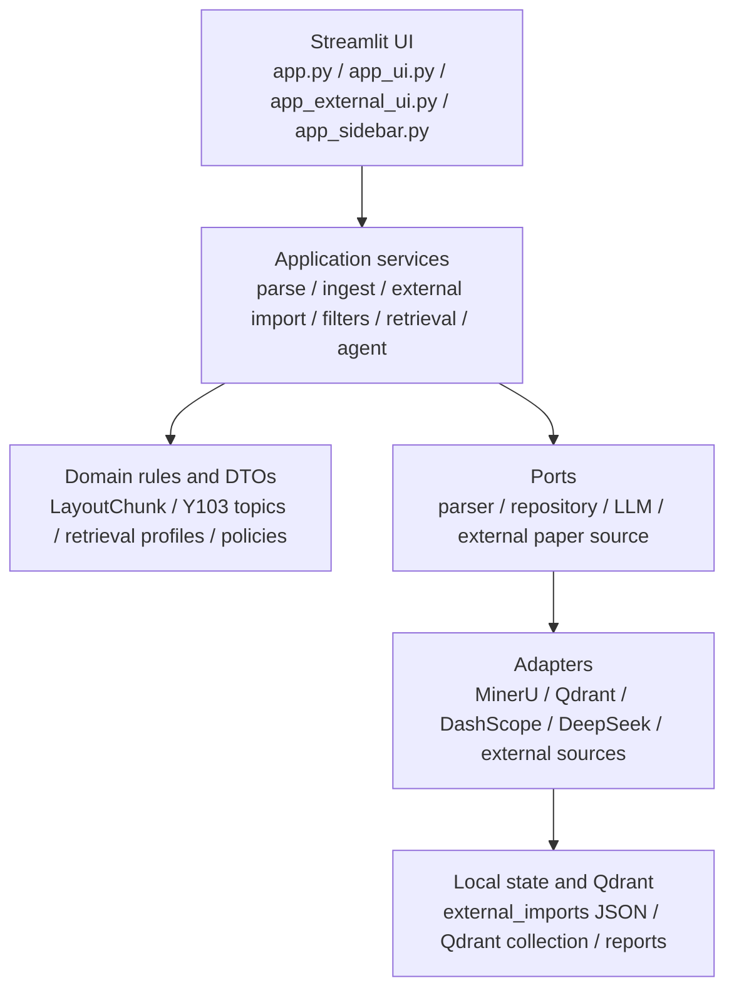

# PaperSort 架构关键决策记录

最后更新：2026-06-09

本文记录 PaperSort 当前已经确认的关键架构决策、做出这些决策的原因，以及对应的取舍。它不是需求清单，也不是实现细节手册；它的作用是在后续继续重构、排查问题、增加新功能时，提供一份共同的判断基准。

## 总体原则

| 原则 | 含义 | 落地方式 |
| --- | --- | --- |
| 高内聚 | 同一类变化集中在同一层或同一模块里 | 主题规则、过滤规则、RAG 策略、外部服务调用分别收口 |
| 低耦合 | UI、业务用例、领域规则、外部服务互不直接绑定 | 使用 `domain / application / ports / adapters` 分层 |
| 兼容迁移 | 重构时尽量不改变已有 UI 调用和返回结构 | 保留 `app_pipeline.py`、`app_utils.qdrant_search()`、`QdrantStore` 等兼容门面 |
| 小步验证 | 不做大规模测试拖慢迭代 | 每轮只跑 touched modules 的 focused tests 和 1-3 条 smoke |
| 用户任务优先 | UI 按用户要完成的任务组织，而不是按代码模块组织 | 顶层工作区固定为在线获取论文、导入论文、检索召回 |

## 当前系统结构

## 决策总览

| 编号 | 决策 | 当前状态 |
| --- | --- | --- |
| ADR-001 | 采用分层架构：`domain / application / ports / adapters / UI` | 已采用 |
| ADR-002 | 保留兼容门面，避免第一阶段破坏 UI 和旧入口 | 已采用 |
| ADR-003 | MinerU 作为推荐解析主路径，legacy 只做兼容和对照 | 已采用 |
| ADR-004 | `LayoutChunk` 和 pipeline dict 返回结构保持稳定 | 已采用 |
| ADR-005 | 表格解析拆成规则、候选、Judge、存储决策边界 | 已采用 |
| ADR-006 | Qdrant 继续作为主存储，`QdrantStore` 保留 facade | 已采用 |
| ADR-007 | 切换 embedding 模型后允许重置数据 | 已确认 |
| ADR-008 | UI 顶层固定为在线获取论文、导入论文、检索召回 | 已采用 |
| ADR-009 | 侧栏只显示当前工作区上下文参数 | 已采用 |
| ADR-010 | Embedding / Rerank 设置只出现在导入工作区 | 已采用 |
| ADR-011 | 外部论文获取统一进入在线获取论文工作区 | 已采用 |
| ADR-012 | 候选过滤放在自动定时搜索之后、候选库之前 | 已采用 |
| ADR-013 | 过滤规则做成显式模块，允许用户查看和修改标准 | 已采用 |
| ADR-014 | 每日简报复用候选库分类结果，不重复调用 LLM | 已采用 |
| ADR-015 | 最近一次获取最新论文时间使用同一份 metadata | 已采用 |
| ADR-016 | 后台计划任务独立运行，不依赖打开 Streamlit | 已采用 |
| ADR-017 | 定时任务用隐藏 wrapper，避免每小时弹出窗口 | 已采用 |
| ADR-018 | RAG 使用 `RetrievalProfile` 管理用户级召回策略 | 已采用 |
| ADR-019 | Agent 回答必须保留结构化证据来源 | 已采用 |
| ADR-020 | Y103 16 分类主题抽成共享领域目录 | 已采用 |
| ADR-021 | 检索召回工作区不再放已保存结果作为主功能 | 已采用于主 UI |
| ADR-022 | 启动中心优先于 Pake 打包 | 已采用 |
| ADR-023 | 验证策略以 focused tests 和少量 smoke 为主 | 已采用 |

## ADR-001：采用分层架构

**决策**

项目按以下边界组织：

| 层 | 职责 | 示例 |
| --- | --- | --- |
| `domain` | 领域模型、纯规则、策略定义 | `retrieval_profile.py`, `y103_topics.py`, `table_storage_policy.py` |
| `application` | 应用用例和流程编排 | `external_imports.py`, `search.py`, `agent_search.py`, `external_filters.py` |
| `ports` | 抽象接口 | `repositories.py`, `llm.py`, `external_papers.py` |
| `adapters` | 外部系统实现 | Qdrant、MinerU、DashScope、DeepSeek、PubMed/OpenAlex |
| UI | Streamlit 输入、状态、展示 | `app.py`, `app_ui.py`, `app_external_ui.py`, `app_sidebar.py` |

**原因**

早期代码把 UI、业务流程、Qdrant、LLM、外部 API 混在一起，新增一个功能会牵动多个模块。分层后，每种变化有固定位置：换模型改 adapter，改筛选规则改 application/domain，改页面布局改 UI。

**取舍**

短期会多一些文件和转发函数，但长期更容易定位问题，也更容易替换外部服务。

## ADR-002：保留兼容门面

**决策**

继续保留以下入口作为兼容 facade：

| 入口 | 作用 |
| --- | --- |
| `app_pipeline.py` | 保持 UI 调用解析、入库、质量分析的旧函数名 |
| `app_utils.qdrant_search()` | 保持手动检索和旧调用入口 |
| `src.application.search.search_chunks()` | 新的应用层检索入口 |
| `src.application.agent_search.run_literature_agent_query()` | Agent 检索应用层入口 |
| `QdrantStore` | 保持 Qdrant 兼容类，同时内部逐步拆 adapter |

**原因**

重构目标是不改变现有主流程行为。直接删除旧入口会让 Streamlit 页面、测试、脚本、计划任务同时断裂，风险太高。

**取舍**

兼容门面会让一段时间内存在“新旧路径并存”。后续清理时应先确认没有 UI、测试或脚本依赖。

## ADR-003：MinerU 作为解析主路径

**决策**

MinerU 是推荐解析主路径。Legacy 解析链路继续保留，但默认隐藏，只用于对照、回归和历史兼容。

**原因**

MinerU 在 PDF 布局、表格、图片 Figure group 方面更适合作为稳定主链路。Legacy 路径仍有历史价值，但不应继续扩大职责。

**取舍**

Legacy 代码不会立刻删除，因为它仍可能用于展示旧结果、回归旧样本或排查差异。

参考文档：[PARSER_BACKENDS.md](PARSER_BACKENDS.md)

## ADR-004：稳定主链路契约

**决策**

`PDF -> LayoutChunk -> verdict/quality -> Qdrant -> search/agent` 是主链路。第一阶段不改变主要 dict 返回结构和 UI 依赖字段。

**原因**

UI、入库、质量分析、检索都依赖这些字段。先稳定契约，才能安全拆内部模块。

**取舍**

内部可能仍有 dict 而非强类型 DTO。后续可以逐步引入 typed DTO，但要保持 facade 输出兼容。

## ADR-005：表格解析边界拆分

**决策**

表格解析不再由一个类包揽所有职责，而是拆成：

| 边界 | 职责 |
| --- | --- |
| 候选区域规则 | 判断哪里像表格 |
| 结构抽取 | 从候选区域提取行列结构 |
| 质量规则 | 判断结构是否可用 |
| LLM Judge | 对失败或可疑候选做判断 |
| 存储决策 | 判断是否入库、是否保留候选 |

**原因**

表格问题天然复杂，把“识别”“解析”“判断”“是否入库”混在一起会导致误删、难测和难复现。

**取舍**

模块数增加，但每个模块职责更清楚。可疑候选倾向于保留诊断信息，而不是直接物理删除。

## ADR-006：Qdrant 存储继续作为主向量库

**决策**

继续使用 Qdrant 作为主向量库。`QdrantStore` 作为兼容 facade 保留，内部逐步拆成 collection、embedding、搜索、rerank、payload、library adapter。

**原因**

Qdrant 已承载当前 chunk 级入库、按论文删除、payload 更新、hybrid search 和检索评测。直接替换存储会扩大风险。

**取舍**

`QdrantStore` 仍然偏大，是后续继续瘦身的对象。但它作为 facade 可以保护上层不受内部拆分影响。

## ADR-007：切换 embedding 模型后允许重置数据

**决策**

切换 embedding provider、embedding dimension 或 collection 时，允许清空或重建当前向量库。

**原因**

不同 embedding 模型生成的向量空间不兼容。混用旧向量和新向量会造成召回质量异常，甚至维度错误。

**取舍**

需要重新导入论文，但这是正确成本。为降低误操作风险，UI 在 Embedding 设置中明确提示需要重建 collection。

## ADR-008：UI 顶层工作区按用户任务划分

**决策**

主 UI 顶层只保留三个大类：

| 工作区 | 解决的问题 |
| --- | --- |
| 在线获取论文 | 从外部来源发现、筛选、形成候选 |
| 导入论文 | 本地 PDF 导入、入库、论文库与质量分析 |
| 检索召回 | 手动召回和 Agent 召回 |

**原因**

早期“论文库”和“分析”功能重复，用户会同时看到太多不相关入口。按任务划分后，用户只看到当前任务需要的界面。

**取舍**

“论文库与质量分析”被归入导入论文工作区，因为它本质上是导入后的管理和质量补充，不再作为单独一级目录。

## ADR-009：侧栏只做上下文参数区

**决策**

侧栏不再作为主功能入口，只显示当前工作区相关参数。

| 工作区 | 侧栏内容 |
| --- | --- |
| 在线获取论文 | 当前入口说明 |
| 导入论文 | 解析模式、库状态、Embedding/Rerank 设置 |
| 检索召回 | 当前论文过滤、Rerank 默认状态 |

**原因**

把上传 PDF、外部获取、向量库管理、搜索参数全部塞到侧栏，会造成用户不知道当前应该点哪里。侧栏只放上下文，主区负责动作。

**取舍**

部分设置入口更“收起来”了，但主流程点击次数更少、认知负担更低。

## ADR-010：Embedding / Rerank 设置只放在导入工作区

**决策**

Embedding / Rerank 设置只在导入论文工作区出现，不在在线获取和检索召回中全局常驻。

**原因**

Embedding 设置会影响入库数据和 collection，不是用户每次搜索时都需要关注的参数。放在所有页面会制造噪音。

**取舍**

检索页面只展示当前 Rerank 状态和召回模式，深层模型配置需要回到导入工作区调整。

## ADR-011：外部论文获取统一进入在线获取论文

**决策**

外部论文相关功能全部归入在线获取论文工作区：

| 子视图 | 职责 |
| --- | --- |
| 每日简报 | 默认首页，查看今日筛选后的重点 |
| 手动搜索 | 临时刷新外部来源 |
| 自动定时搜索 | 管理主题、周期、筛选标准 |
| 候选库 | 查看过滤后的候选并导入 PDF |

**原因**

外部导入和本地 PDF 导入是两种不同任务。前者是“发现论文”，后者是“把论文入库”。合并到同一个页面会让流程混乱。

**取舍**

候选库只显示被筛选后的结果，减少干扰；需要调整筛选规则时去自动定时搜索视图。

## ADR-012：候选过滤发生在自动定时搜索之后

**决策**

自动定时搜索完成外部检索后，立即对候选应用过滤规则；候选库默认展示过滤后的候选。

**原因**

如果在每日简报才过滤，候选库里仍然会堆满不相关论文，简报整理就失去意义。过滤应属于“获取候选”流程，而不是“展示简报”流程。

**取舍**

过滤会影响候选库可见结果，所以必须在 UI 显式展示过滤标准，并允许用户修改。

## ADR-013：过滤规则模块化

**决策**

外部候选过滤由 `src.application.external_filters` 负责。当前内置 Y103 16 分类过滤，但设计上保留 `filter_type` 和 `filter_config`。

**原因**

不能把 Y103 写死进每日简报或候选库 UI。未来可能要筛选别的课题、别的论文类型、别的来源，必须能新增过滤规则而不改主流程。

**取舍**

当前过滤类型还少，但接口已经给扩展留出位置。

## ADR-014：每日简报不重复调用 LLM 分类

**决策**

每日简报优先复用候选库已有分类结果。缺少分类的旧候选只做规则兜底，默认不调用 LLM。

**原因**

分类应该在候选进入库之前完成。简报只是展示和聚合，不应该每次生成时再走慢速 LLM。

**取舍**

旧候选如果没有分类，简报可能只得到规则级判断。需要更高质量时，应回到候选过滤或自动搜索流程补分类。

## ADR-015：最近一次获取最新论文时间只记录一份

**决策**

每日简报手动触发“自动获取最新论文”和后台自动定时搜索共用同一个 `latest_paper_fetch_at` metadata。

**原因**

用户关心的是“最近一次系统获取外部新论文是什么时候”，而不是区分是按钮触发还是计划任务触发。写两份时间会造成界面重复和逻辑分叉。

**取舍**

如果未来需要审计每次运行明细，可以看 monitor run summary；首页只展示统一的最近获取时间。

## ADR-016：后台计划任务不依赖打开 Streamlit

**决策**

外部论文自动定时搜索通过 Windows 计划任务独立运行，不依赖用户打开 Streamlit 页面。

**原因**

“自动定时搜索”如果必须打开应用才执行，就不是真正自动。后台任务能在不开 UI 的情况下检查到期主题。

**取舍**

需要安装计划任务，并维护日志和状态检查入口。

## ADR-017：计划任务静默运行

**决策**

计划任务使用 `wscript.exe` 调用隐藏 wrapper，避免每小时弹出 PowerShell 窗口。

**原因**

每到固定分钟弹窗会打断用户，尤其是后台监控任务本来就不需要用户交互。

**取舍**

静默运行后，错误不再直接显示在窗口里；需要通过 `logs/external_monitor_task.log` 和启动中心查看。

## ADR-018：RAG 使用 RetrievalProfile

**决策**

RAG 检索使用用户级 profile 管理策略：

| Profile | 用途 | 默认策略 |
| --- | --- | --- |
| `quick` | 日常找论文、泛检索 | 词面补召回，不默认 Rerank |
| `evidence` | 找具体证据、数值、表格 | 词面补召回，选择性 Rerank，`rerank_top_n=10` |
| `agent` | 开放式问题综合回答 | 选择性 Rerank，论文内证据扩展，相邻上下文扩展 |

**原因**

用户不应该面对一堆底层开关。Profile 把常用意图映射到稳定策略，高级参数仍保留给调试。

**取舍**

查询改写和多路召回暂不默认启用，因为它们可能触发慢速 LLM 或增加误召回。它们保留在高级参数中。

## ADR-019：Agent 回答必须带证据来源

**决策**

Agent 合成回答时使用 `[S1] / [S2]` 证据编号，并返回结构化 `sources`。UI 将 Sources 渲染成可展开证据卡片。

**原因**

RAG 的价值不只是生成答案，还要让用户知道答案来自哪篇论文、哪一页、哪个 chunk。没有证据来源，回答很难被信任。

**取舍**

回答会略长，但可追溯性更高。旧的 Markdown `### Sources` 兼容输出仍保留，UI 会避免重复展示。

## ADR-020：Y103 16 分类主题共享

**决策**

Y103 16 分类主题、关键词、默认检索式集中在 `src.domain.y103_topics`。外部过滤、每日简报分类、RAG smoke 都从这里读取。

**原因**

同一套主题如果在外部导入、候选过滤、RAG 评测中各写一份，很快会不一致。主题属于领域知识，应在 domain 层统一维护。

**取舍**

新增课题时需要先定义领域主题，再让过滤和评测引用它。这个流程更严格，但更可控。

## ADR-021：检索召回不放已保存结果作为主功能

**决策**

检索召回工作区只保留手动召回和 Agent 召回。已保存结果不再作为主工作区里的同级功能。

**原因**

“已保存结果”不是召回动作，会分散检索页面注意力。用户进入检索召回时，最关心的是输入 query、查看证据、让 Agent 综合。

**取舍**

如果历史保存结果服务仍存在，应视为兼容能力，不作为新 UI 的扩展方向。

## ADR-022：启动中心优先于 Pake 打包

**决策**

当前不把 Pake 作为主要交付方式，而是提供启动中心和脚本：

| 文件 | 用途 |
| --- | --- |
| `start_papersort_center.bat` | 打开 PaperSort 控制中心 |
| `scripts/papersort_control.ps1` | 启动、停止、重启、看状态、修复防火墙、安装计划任务 |
| `start_papersort_lan.bat` | 局域网访问启动入口 |

**原因**

PaperSort 不是纯前端网页。它依赖 Streamlit、Qdrant、API key、计划任务、端口、防火墙和本地日志。Pake 只能包一层 webview，不能真正简化这些本地服务问题。

**取舍**

启动中心没有原生桌面 App 的外观，但它能解决真实运维问题：端口、后台进程、防火墙、日志和计划任务。

## ADR-023：轻量验证策略

**决策**

默认不跑全量 `pytest -q`。每轮只跑：

| 类型 | 示例 |
| --- | --- |
| focused tests | 当前改动涉及的 application/domain/UI 边界测试 |
| smoke | 1-3 条 RAG smoke 或 1 篇 PDF 路径验证 |
| compile check | `python -m py_compile` 覆盖触碰文件 |

**原因**

项目涉及外部服务、LLM、Qdrant、PDF 解析和 UI，做大规模测试会很慢。当前阶段更需要小步快跑，及时发现局部回归。

**取舍**

轻量验证不能证明全系统无问题。重大合并、模型切换、数据重建后仍应做更完整的手动 smoke。

## 当前仍需注意的边界

| 问题 | 当前判断 |
| --- | --- |
| `QdrantStore` 仍偏大 | 作为 facade 保留，内部继续拆 adapter |
| Legacy parser 仍存在 | 默认隐藏，不再扩大职责 |
| 真实 RAG 质量未完全验证 | 当前 smoke 只证明链路可跑，需要导入真实 Y103 论文后再评估 |
| 旧 UI 入口仍可能存在兼容代码 | 主入口以三个工作区为准，旧入口清理要先确认依赖 |
| 已保存结果相关代码 | 不作为检索召回主功能，后续可单独清理历史服务 |

## 后续新增功能的判断清单

新增功能前先回答这些问题：

1. 它属于在线获取论文、导入论文、还是检索召回？
2. 它是领域规则、应用流程、外部服务适配，还是 UI 展示？
3. 是否需要新增 port，避免 application 直接依赖外部 SDK？
4. 是否会改变 `LayoutChunk`、入库结果、搜索结果或 Agent 结果契约？
5. 是否需要新增过滤规则或主题配置，而不是写死在 UI？
6. 是否会触发 LLM、外部 API 或慢任务？如果会，是否应该放入后台任务或高级参数？
7. 是否只需要 focused tests 和一条 smoke，还是需要更完整验证？

## 相关文档

| 文档 | 内容 |
| --- | --- |
| [PARSER_BACKENDS.md](PARSER_BACKENDS.md) | MinerU、legacy parser 和解析后端决策 |
| [RETRIEVAL_FINDINGS.md](RETRIEVAL_FINDINGS.md) | 检索评测结论、lexical backfill、上下文扩展 |
| [RAGFLOW_RETRIEVAL_COMPARISON.md](RAGFLOW_RETRIEVAL_COMPARISON.md) | PaperSort 与 RAGFlow 检索算法对比 |
