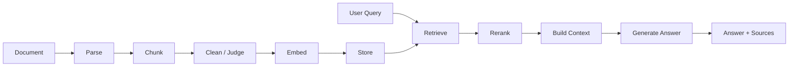

# 08-RAG 系统架构

RAG 看起来像“向量检索 + 大模型回答”，但真实项目里它更像一条生产线。文档进来以后，要解析、切分、清洗、判断质量、生成 embedding、入库、检索、重排、组装上下文、生成回答。任何一个环节做得含糊，最后都会表现成“回答不准”。

所以 RAG 架构的核心不是把模型换大，而是让每个环节都可解释、可替换、可测试。

## 为什么需要它

没有架构的 RAG 系统常见问题：

- 文档解析坏了，但你以为是检索坏了。
- chunk 切得不好，但你以为是模型不聪明。
- metadata 不完整，导致过滤、引用、溯源都困难。
- 检索召回没问题，但上下文组装把关键段落丢了。
- 回答生成失败，却没有记录用过哪些 sources。

RAG 的每个阶段都在改变数据形状。架构要做的是把这些数据形状和阶段边界固定下来。

## 基本链路



## 什么时候需要认真设计 RAG 架构

需要：

- 文档类型不止一种，比如论文、表格、图片、网页、笔记。
- 要支持引用来源、页码、bbox、chunk 质量等 metadata。
- 检索结果要服务 Agent，而不只是普通问答。
- 要做批量入库、增量更新、去重、质量评估。
- 需要长期维护向量库里的数据。

暂时可以简单：

- 只验证一个小知识库能不能问答。
- 文档少、格式稳定、没有引用和溯源要求。
- 检索失败可以人工检查，不需要自动诊断。

## 模块拆分

| 模块 | 负责什么 | 不负责什么 |
|---|---|---|
| Document Loader | 读取文件和基本元信息 | 不做内容理解 |
| Parser | 把文件变成结构化 block | 不决定是否入库 |
| Chunker | 把 block 切成可检索片段 | 不调用向量库 |
| Cleaner / Judge | 判断质量、去噪、降级 | 不负责最终回答 |
| Embedder | 文本转向量 | 不决定检索策略 |
| Vector Store | 存储和查询向量 | 不拼 prompt |
| Retriever | 召回候选 chunk | 不写最终答案 |
| Reranker | 调整候选排序 | 不改变原始内容 |
| Context Builder | 组装上下文 | 不访问数据库 |
| Answer Generator | 基于上下文回答 | 不决定索引结构 |

## 例子：论文解析 RAG

论文解析系统里，chunk 不只是文本。它可能有：

- `paper_id`
- `page`
- `bbox`
- `content_type`
- `raw_content`
- `table_quality`
- `global_order`
- `section_title`

这些 metadata 决定后续能不能做高质量检索和引用。如果入库阶段只保存一段纯文本，后面想回答“这张表说明了什么”或“出处在哪一页”就很难补救。

更好的做法是把 `raw_content` 和用于回答的 `content` 分开。原始内容用于溯源和重新处理，增强后的内容用于检索和回答。

## 例子：Agent 使用 RAG

普通 RAG 一次检索后直接回答。Agent 使用 RAG 时，检索可能变成多轮：

```text
问题：比较两篇论文的方法差异
Agent:
  1. 检索论文 A 的方法部分
  2. 检索论文 B 的方法部分
  3. 如果信息不足，再查表格和实验结果
  4. 综合回答
```

这要求 Retriever 的接口稳定，并且返回结果要结构化。Agent 不能只拿到一段拼好的 prompt，它需要知道每个来源的 paper、page、score、content_type。

## 例子：长期记忆和 RAG 的关系

长期记忆也可以用检索，但它不是普通知识库。

知识库检索回答“资料里有什么”。

记忆检索回答“这个用户长期偏好什么、之前说过什么、哪些东西需要延续”。

所以最好把 `KnowledgeRetriever` 和 `MemoryRetriever` 分开。它们可能都用向量库，但业务规则不同。

## 坏设计长什么样

- 入库时只保存文本，不保存来源和处理状态。
- 检索函数顺手生成最终回答。
- chunk 清洗规则散落在 parser、store、retriever 里。
- prompt 里直接拼接数据库原始 payload。
- 没有记录回答使用了哪些 chunk。
- 重新索引时无法判断哪些数据过期。

## 更好的拆法

- 每个阶段都有明确输入输出。
- 原始内容、清洗内容、增强内容分开保存。
- metadata 从解析阶段开始就稳定维护。
- 检索结果使用内部对象，比如 `RetrievedChunk`。
- 回答必须带 sources，方便调试和溯源。
- 入库、检索、生成分别可测试。

## 可执行产物：RAG 架构模块清单

```markdown
## RAG 架构设计

### 文档进入系统
- 支持文档类型：
- 文档 ID 生成规则：
- 去重规则：

### 解析与切分
- Parser 输入：
- Parser 输出：
- Chunk 字段：
- raw_content 是否保留：

### 入库
- Embedding 模型：
- Vector store：
- Metadata 字段：
- 失败和重试：

### 检索
- 检索输入：
- Filter：
- Top K：
- Rerank：
- 返回对象：

### 回答
- Context 组装规则：
- 引用来源格式：
- 回答失败策略：

### 诊断
- 如何判断是解析问题：
- 如何判断是检索问题：
- 如何判断是生成问题：
```

## 给 Codex 的提示词

```text
请按 RAG 全链路审查当前实现。
不要只看向量检索，请覆盖解析、chunk、清洗、embedding、入库、检索、rerank、context、answer。
请输出每个阶段的输入输出、当前坏味道、最小改造建议。
先不要修改代码。
```

