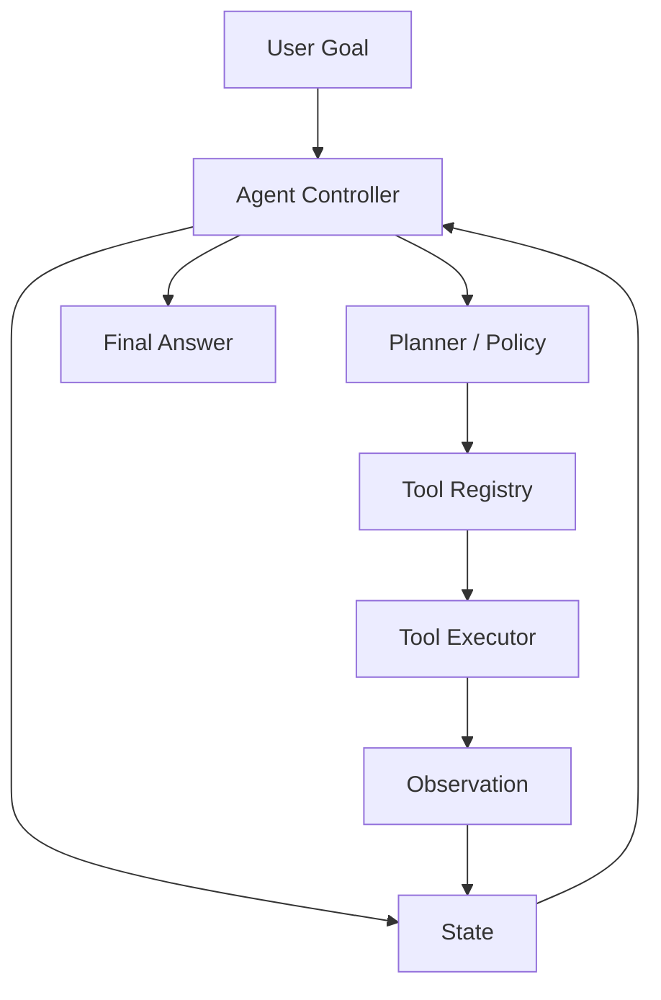

# 09-Agent 系统架构

Agent 不是“让模型自己循环想办法”这么简单。真实项目里的 Agent 要能调用工具、保持状态、处理失败、限制行动范围，还要能解释自己做了什么。没有架构的 Agent 很容易变成一个黑盒：它有时很聪明，有时乱跑，有时失败了也不知道为什么。

Agent 架构的重点是把“思考、状态、工具、观察、控制策略”拆开。

## 为什么需要它

Agent 系统比普通 RAG 更容易失控，因为它不是一次输入一次输出，而是一个循环：

```text
观察问题 -> 制定下一步 -> 调用工具 -> 读取结果 -> 再决定下一步
```

如果这个循环没有边界，会出现：

- 工具输入格式不稳定。
- 工具返回异常时模型继续瞎猜。
- Agent 重复调用同一个工具。
- 长期记忆污染当前任务。
- 模型把调试信息当作事实。
- Codex 改一个工具时破坏整个 Agent loop。

## 最小架构



## 什么时候需要 Agent 架构

需要：

- 一个问题需要多步检索、比较、总结或写入。
- Agent 可以调用多个工具。
- 需要限制工具权限和执行次数。
- 需要记录每一步 trace 以便调试。
- Agent 会使用长期记忆或项目上下文。

暂时不需要 Agent：

- 单次 RAG 检索就能回答。
- 任务没有外部行动，只是普通文本生成。
- 工具调用结果无法验证，Agent 只是在包装复杂 prompt。

## 例子：论文问答 Agent

用户问：“这几篇论文里哪种方法更适合我的数据集？”

普通 RAG 可能一次检索后回答。Agent 可以做：

```text
1. 搜索每篇论文的方法部分。
2. 搜索实验设置和数据集描述。
3. 对比任务假设。
4. 如果缺信息，继续检索表格或结论。
5. 给出建议和引用来源。
```

这里需要：

- `PlanState` 记录已经查过什么。
- `search_literature` 工具有稳定 schema。
- `Observation` 标准化检索结果。
- `StopPolicy` 防止无限检索。

## 例子：项目内 Codex 协作 Agent

你让 Codex 帮你做架构重构时，它其实也在执行一种 Agent 流程：

```text
读文件 -> 建立假设 -> 搜索引用 -> 修改代码 -> 运行测试 -> 根据失败修复
```

如果任务说明没有边界，Agent 很容易过度修改。好的架构文档可以告诉它：

- 哪些入口必须保持不变。
- 哪些模块可以新增。
- 哪些层不能反向依赖。
- 哪些测试必须通过。

## 例子：Agent 使用长期记忆

长期记忆不能直接塞进 Agent prompt。更好的方式是：

```text
MemoryRetriever:
  根据任务检索相关记忆

MemoryPolicy:
  判断哪些记忆可用于当前任务

AgentState:
  记录本轮使用了哪些记忆
```

这样可以避免模型把过期偏好、低置信度记忆当作硬事实。

## 坏设计长什么样

- Agent loop 直接调用各种工具函数，没有统一协议。
- 工具返回字符串，里面混着数据、错误和解释。
- 没有最大步数、最大工具调用次数、失败策略。
- Agent 状态只是聊天记录，没有结构化字段。
- 长期记忆、RAG 检索、工具观察全部拼成一个大 prompt。
- 无法回放 Agent 为什么得出这个答案。

## 更好的拆法

- `AgentController` 控制循环，不做具体工具工作。
- `AgentState` 保存任务目标、步骤、观察、使用过的来源。
- `ToolRegistry` 管理可用工具和 schema。
- `ToolExecutor` 负责执行、超时、错误标准化。
- `Policy` 决定停止、重试、降级和权限。
- `Trace` 记录每一步，供 UI、日志和调试使用。

## 可执行产物：Agent 最小架构模板

```markdown
## Agent 设计

### 目标
- Agent 要完成什么任务：
- 不允许做什么：

### 状态
- user_goal：
- plan：
- steps：
- observations：
- used_sources：
- memory_used：
- status：

### 工具
- 工具名：
- 输入 schema：
- 输出 schema：
- 错误 schema：
- 权限限制：

### 控制策略
- 最大步数：
- 何时停止：
- 何时重试：
- 何时转人工或返回失败：

### Trace
- 每步记录：
- 是否展示给用户：
- 是否用于调试：
```

## 给 Codex 的提示词

```text
请按 Agent 架构审查当前实现。
重点检查状态、工具协议、执行循环、失败策略、trace 和长期记忆边界。
请输出：
1. 当前 Agent loop 的步骤
2. 哪些状态没有结构化
3. 工具协议是否一致
4. 最小可行重构方案
先不要修改代码。
```

